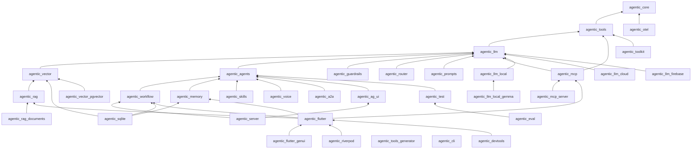

# Phase 5 — Ecosystem architecture

## 5.1 Design rules (carried forward, plus three new ones)

The existing rules in `doc/architecture.md` hold: dependencies point downward,
ports live below adapters, Flutter is a leaf, plugins depend on a layer rather
than the framework. Growth to ~50 packages needs three more:

1. **Protocol packages are peers of the runtime, not above it.** MCP, A2A and
   AG-UI each translate between a wire format and a framework port (`Tool`,
   `Agent`, `AgentChunk`). None may depend on another protocol package.
2. **Native and platform dependencies only in bridge packages.** A bridge's
   name ends in the thing it bridges (`agentic_llm_local_gemma`,
   `agentic_vector_objectbox`, `agentic_llm_firebase`). The package it bridges
   *into* never imports it.
3. **Server-only dependencies never reach a Flutter app by accident.**
   `shelf`, `postgres` and cloud auth live in `_server` / `_cloud` packages; the
   umbrella `agentic_flutter` never re-exports them. A CI check resolves
   `agentic_flutter` and fails if any such package appears.

## 5.2 Package taxonomy

| Tier | Role | Packages |
|---|---|---|
| **Core** (stable, 1.0 first) | Vocabulary and ports | `agentic_core`, `agentic_tools`, `agentic_llm`, `agentic_agents` |
| **Capabilities** (extensions) | Built-in behaviour over the core | `agentic_workflow`, `agentic_memory`, `agentic_vector`, `agentic_rag`, `agentic_guardrails`, `agentic_router`, `agentic_skills`, `agentic_prompts`, `agentic_voice`, `agentic_vision`, `agentic_graph` |
| **Protocols** | Wire formats ↔ ports | `agentic_mcp`, `agentic_mcp_server`, `agentic_a2a`, `agentic_ag_ui` |
| **Adapters / plugins** | One vendor or engine each | `agentic_llm_cloud`, `agentic_llm_firebase`, `agentic_llm_local` + `_gemma` / `_llamadart` / `_nano` / `_apple`, `agentic_vector_*`, `agentic_rag_documents`, `agentic_sqlite`, `agentic_drift`, `agentic_toolkit`, `agentic_otel`, `agentic_sync` |
| **Runtime** | Where agents run | `agentic_flutter` (app), `agentic_server` (service) |
| **UI** | Flutter leaves | `agentic_flutter`, `agentic_flutter_genui`, `agentic_flutter_voice`, `agentic_riverpod`, `agentic_bloc`, `agentic_chat_ui`, `agentic_ai_toolkit` |
| **Interop** | Other ecosystems | `agentic_genkit`, `agentic_genai_primitives` |
| **Quality** | Dev-time | `agentic_test`, `agentic_flutter_test`, `agentic_eval`, `agentic_sim`, `agentic_tools_generator` |
| **Developer tools** | Around the code | `agentic_cli`, `create_agentic_app`, `agentic_devtools`, `agentic_workflow_studio`, `agentic_marketplace` |
| **Enterprise** | Governance | `agentic_auth`, `agentic_usage` |
| **Internal** (`publish_to: none`) | Repo health | `agentic_benchmark`, `agentic_integration`, `tool/` |

## 5.3 Layered view

```
┌──────────────────────────────────────────────────────────────────────────────────────┐
│ DEVELOPER TOOLS   agentic_cli · create_agentic_app · agentic_devtools · workflow_studio│
├──────────────────────────────────────────────────────────────────────────────────────┤
│ UI (Flutter leaves)                                                                  │
│   agentic_flutter ─ agentic_flutter_genui ─ agentic_flutter_voice ─ agentic_riverpod │
│   agentic_bloc ─ agentic_chat_ui ─ agentic_ai_toolkit                                │
├───────────────────────────────┬──────────────────────────────────────────────────────┤
│ RUNTIMES                      │ PROTOCOLS                                            │
│   agentic_server              │   agentic_mcp · agentic_mcp_server                   │
│                               │   agentic_a2a · agentic_ag_ui                        │
├───────────────────────────────┴──────────────────────────────────────────────────────┤
│ CAPABILITIES                                                                         │
│   agentic_workflow   agentic_memory   agentic_rag   agentic_guardrails               │
│   agentic_skills     agentic_router   agentic_prompts   agentic_voice   agentic_graph│
├──────────────────────────────────────────────────────────────────────────────────────┤
│ CORE                                                                                 │
│   agentic_agents → agentic_llm → agentic_tools → agentic_core                        │
│                     agentic_vector (beside llm: embeddings only)                     │
├──────────────────────────────────────────────────────────────────────────────────────┤
│ ADAPTERS (depend on exactly one port layer)                                          │
│   llm: _cloud _firebase _local(_gemma _llamadart _nano _apple)                       │
│   vector: _pgvector _objectbox _pinecone _chroma _weaviate      store: agentic_sqlite│
│   rag: agentic_rag_documents   tools: agentic_toolkit   obs: agentic_otel            │
├──────────────────────────────────────────────────────────────────────────────────────┤
│ QUALITY (dev_dependencies)   agentic_test · agentic_eval · agentic_sim · generator   │
└──────────────────────────────────────────────────────────────────────────────────────┘
```

## 5.4 Dependency graph

Solid edges are `dependencies`; the graph is acyclic by construction and is
checked in CI (see 5.7).



**Umbrella policy.** `agentic_flutter` keeps re-exporting only the core and
capability packages it re-exports today. New capabilities get **one-line opt-in**
imports (`import 'package:agentic_guardrails/agentic_guardrails.dart'`) instead of
joining the umbrella, which keeps app size and the transitive graph stable.

**Two current edges to revisit.**

- `agentic_mcp → agentic_llm`. The only symbols used are the SSE decoder
  (`decodeServerSentEvents`) and `mapHttpFailure`, both generic HTTP plumbing
  (`agentic_vector` also imports `mapHttpFailure` for Qdrant). Move them into a
  small `agentic_http` package (or `agentic_core/http.dart` if the "no I/O in
  core" rule is relaxed for pure decoders), and drop the edge so a tools-only MCP
  server does not pull in every model adapter.
- `agentic_sqlite → agentic_agents / memory / vector / workflow`. One package
  implementing four ports forces all four onto every user. Keep the single
  database, but expose stores through **libraries** (`package:agentic_sqlite/vector.dart`)
  and consider `agentic_sqlite_core` + thin per-port packages if app size
  complaints appear.

## 5.5 Repository and folder structure

Keep a single monorepo (pub workspace) for everything the maintainer owns;
community adapters live in their own repositories and are listed in the
marketplace index.

```
agentic_flutter/                      # repo (consider renaming to `agentic` — see 5.8)
├── AGENTS.md                         # how AI assistants should work in this repo
├── README.md · CHANGELOG.md · CONTRIBUTING.md · SECURITY.md · CODE_OF_CONDUCT.md · GOVERNANCE.md
├── llms.txt                          # generated: index of docs for LLMs
├── pubspec.yaml                      # workspace root
├── analysis_options.yaml
├── api/                              # public API snapshots (exists)
├── doc/
│   ├── architecture.md · migration-*.md
│   ├── adr/                          # architecture decision records, numbered
│   ├── rfcs/                         # proposals for features marked Must Have / breaking
│   └── strategy/                     # this document set
├── docs_site/                        # agentic_learn: site source, recipes, error catalogue
├── examples/                         # runnable apps (moved out of packages)
│   ├── pocket_agent/ · recall/       # existing demos, made first-class
│   ├── rag_pdf_qa/ · voice_assistant/ · approval_workflow/ · offline_assistant/
│   ├── mcp_client_oauth/ · mcp_server_http/ · a2a_travel/ · server_agent_ag_ui/
│   └── README.md                     # gallery with screenshots/GIFs
├── packages/
│   ├── core/            agentic_core/ agentic_tools/ agentic_llm/ agentic_agents/
│   ├── capabilities/    agentic_workflow/ agentic_memory/ agentic_vector/ agentic_rag/
│   │                    agentic_guardrails/ agentic_router/ agentic_skills/ agentic_prompts/ agentic_voice/
│   ├── protocols/       agentic_mcp/ agentic_mcp_server/ agentic_a2a/ agentic_ag_ui/
│   ├── adapters/        agentic_sqlite/ agentic_otel/ agentic_llm_cloud/ agentic_llm_firebase/
│   │                    agentic_llm_local/ agentic_llm_local_gemma/ agentic_vector_pgvector/ …
│   ├── flutter/         agentic_flutter/ agentic_flutter_genui/ agentic_flutter_voice/
│   │                    agentic_riverpod/ agentic_bloc/ agentic_flutter_test/
│   ├── runtime/         agentic_server/
│   ├── quality/         agentic_test/ agentic_eval/ agentic_sim/ agentic_tools_generator/
│   └── tooling/         agentic_cli/ create_agentic_app/ agentic_devtools/
├── internal/            agentic_benchmark/ agentic_integration/
├── tool/                release.dart · api_snapshot.dart · check_layering.dart · check_skills.dart
└── .github/
    ├── workflows/       ci.yaml · nightly.yaml · release.yaml · docs.yaml · conformance.yaml
    ├── ISSUE_TEMPLATE/  bug.yml · feature.yml · adapter_request.yml
    └── DISCUSSION_TEMPLATE/
```

**Inside each package** (standardise; today every package has one test file):

```
packages/<tier>/<pkg>/
├── lib/
│   ├── <pkg>.dart                  # the one barrel
│   ├── testing.dart                # fakes + conformance suites for adapter authors
│   └── src/<concept>/…
├── skills/                         # bundled by `dart pub publish`
│   └── <pkg-with-hyphens>-<task>/SKILL.md (+ references/, assets/)
├── example/
│   ├── example.dart                # pub.dev "Example" tab: short, runnable
│   └── README.md                   # links to /examples apps
├── test/
│   ├── <concept>/<unit>_test.dart  # one file per unit under test
│   └── conformance/                # if the package defines a port
├── doc/                            # screenshots, package-specific guides
├── fix_data.yaml                   # dart fix transforms for breaking changes
├── CHANGELOG.md · README.md · LICENSE · pubspec.yaml · analysis_options.yaml
```

Moving packages into tier folders is a one-off path change (workspace
`pubspec.yaml`, CI globs, release tool). Do it in the same release window as
another breaking change so the churn is paid once.

## 5.6 Versioning strategy

**Current state.** The architecture document promises independent versions per
package, but in practice all 14 packages move together (0.1.1 → 0.2.0). That is
the right call pre-1.0 and should be made explicit.

**Recommended model: release trains for the core, independence for the edges.**

| Group | Scheme | Why |
|---|---|---|
| **Core train**: core, tools, llm, agents, workflow, memory, vector, rag, mcp, flutter, test, sqlite, generator | Same `major.minor` across the train; patches independent (e.g. `agentic_llm 0.3.2` with `agentic_core 0.3.0`). Siblings depend on `^0.3.0` | One version to tell users; the migration guide is per train; the `agentic upgrade` codemod targets a train |
| **Adapters, bridges, protocols beyond MCP, UI adapters** | Fully independent semver, constraint on the train (`agentic_llm: ">=0.3.0 <0.5.0"` once the port is stable) | Vendor churn must not force a framework release |
| **Tooling** (cli, devtools, create_agentic_app) | Independent; declares which trains it supports | — |

**Cadence.**

- Train minor every ~8 weeks until 1.0; breaking changes batched into trains,
  never shipped in patches; every break has a `fix_data.yaml` entry where
  mechanically possible and a section in `doc/migration-<train>.md`.
- Patch releases whenever needed (model catalogue updates ship as patches of
  `agentic_llm`, or as a data-only package `agentic_models` to avoid code
  releases entirely).
- Pre-releases (`0.4.0-dev.1`) for any train containing a breaking change to a
  core port, published at least two weeks before the stable train.

**Path to 1.0.** Declare 1.0 per tier, not all at once:

1. `agentic_core`, `agentic_tools` — after CORE-3 (content parts) and TOOLS-1
   (output schemas), because both are breaking to the sealed hierarchies. Target
   month 6.
2. `agentic_llm`, `agentic_agents` — after LLM-1 (catalogue), LLM-3 (caching),
   AGENTS-2 (guardrails stop reason), AGENTS-3/4 (durable runs, interrupts).
   Target month 9.
3. `agentic_workflow`, `agentic_rag`, `agentic_vector`, `agentic_memory`,
   `agentic_flutter` — target month 12.
4. Protocol packages follow their specs: `agentic_mcp` 1.0 when 2026-07-28
   support and OAuth are complete and the interop matrix is green.

**1.0 guarantees** (write them down, as LangChain did for v1): no breaking changes
until 2.0; deprecations live at least two minor versions or six months;
`@experimental` APIs are excluded and listed in each README.

**Tooling.** Keep `tool/release.dart` and the API snapshots; add
`tool/diff_release.dart` output to release notes automatically; tag
`<package>/v<version>` for independent packages and `train/v0.3.0` for trains.

## 5.7 Guardrails for the architecture (CI checks)

| Check | Fails when |
|---|---|
| `check_layering.dart` | a package imports a package not allowed by its tier table |
| `check_umbrella.dart` | `agentic_flutter` resolves `shelf`, `postgres`, `googleapis_auth` or any `_server` / `_cloud` package |
| API snapshot diff | `api/*.txt` changes without a changelog entry |
| Name clash test (exists) | two packages export the same name |
| `check_skills.dart` | a package lacks `skills/`, a skill name does not match its directory or the `<package-with-hyphens>-` prefix, a description exceeds 1,024 characters, or a code sample in a skill fails `dart analyze` |
| Stale model IDs | a default model or catalogue alias is absent from the provider's model list (nightly) |
| Conformance | any adapter fails its port's conformance suite |
| pana | any published package scores below 160 (today only `agentic_core` is scored, at a threshold of 20) |

## 5.8 Naming and brand

- **Repository name.** `agentic_flutter` undersells the pure-Dart server and CLI
  story and is easily confused with the unrelated `flutter_agentic` package.
  Consider renaming the GitHub repository and docs brand to **Agentic for Dart**
  (`agentic-dart`), keeping the package names unchanged (GitHub redirects old
  URLs).
- **Verified publisher.** Create one (for example `agentic.dev`) and transfer
  all packages. Today `publisherId` is `null` for every package, which shows as an
  unverified uploader on pub.dev, a red flag for enterprise evaluators.
