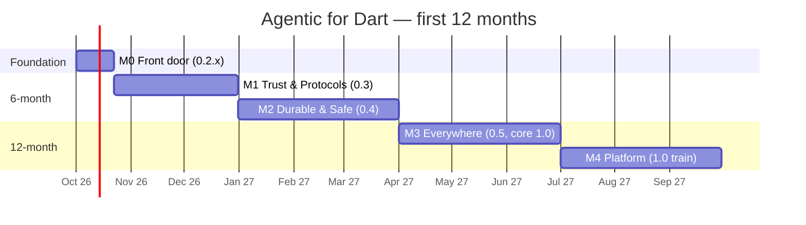
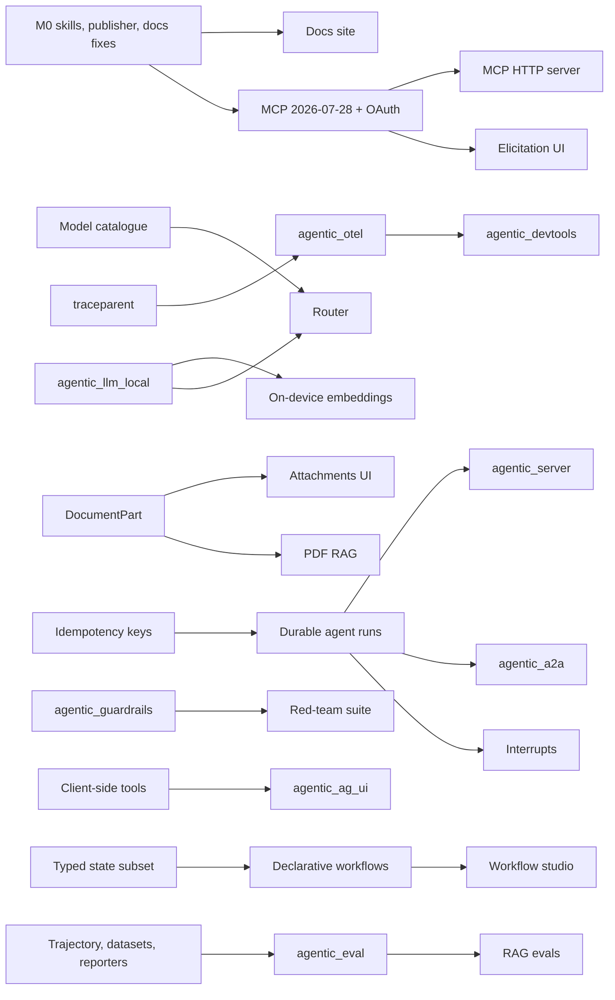

# Phase 7 — Roadmap

## 7.0 Planning assumptions

- **Start:** 1 October 2026. **Horizons:** 6 months (to 31 March 2027),
  12 months (to 30 September 2027), 24-month vision (to 30 September 2028).
- **Capacity.** One maintainer at roughly 24 focused engineer-weeks per six months
  once releases, issues and reviews are paid for. AI-assisted development raises
  that, but the plan does not assume more than ~30 engineer-weeks from the
  maintainer per six months.
- **The honest arithmetic.** The Must Have items for the first six months total
  about 43 engineer-weeks. The plan therefore marks items **🤝 contributor-ready**
  (well-specified, isolated, with tests to copy) and names a **solo cut line**:
  what slips if no contributors arrive.
- **Ordering principle.** Trust and distribution first (cheap, unblocks everything),
  then the protocol and safety features that differentiate, then breadth.
- **Effort** is in engineer-weeks (ew). **Risk**: L / M / H.
  **Community impact**: ★ to ★★★ (how much it moves adoption or contribution).

## 7.1 Timeline overview

---

## 7.2 Six-month roadmap (October 2026 – March 2027)

### M0 — "Front door" · 0.2.x patches · weeks 1–3

Goal: nothing an evaluator sees in the first five minutes is stale, missing or
untrustworthy.

| Item | Ref | Priority | Deps | Effort | Risk | Impact |
|---|---|---|---|---:|---|---|
| Replace stale default model IDs; add retirement canary to nightly | X1, `agentic_integration` | Must | GitHub secrets | 0.6 | L | ★★ |
| Root README status, root CHANGELOG, dynamic test badge, `recall` README | X3 | Must | — | 0.3 | L | ★★ |
| Verified publisher; transfer all 14 packages | 5.8 | Must | domain | 0.2 | L | ★★★ |
| `skills/` in all 14 packages (first 2–4 skills each) + `check_skills.dart` in CI | Phase 8 | Must | `skills` CLI 1.0 | 1.2 | L | ★★★ |
| `AGENTS.md`, `llms.txt`, `SECURITY.md`, `CODE_OF_CONDUCT.md`, issue/discussion templates | X2, X6 | Must | — | 0.4 | L | ★★ |
| pana for every package in CI at 160 | X8 | Must | Linux runner | 0.3 | L | ★ |
| **Total** | | | | **3.0** | | |

**Exit criteria.** All packages have a verified publisher, 160 points, bundled
skills that pass validation, and `dart run skills get` installs them into Claude
Code, Cursor and Copilot in a fresh project (recorded as a GIF for the README).

---

### M1 — "Trust & Protocols" · train 0.3 · October – December 2026

Goal: current MCP, traces that leave the process, UI that demos well, evals in CI.

| Item | Ref | Priority | Deps | Effort | Risk | Impact |
|---|---|---|---|---:|---|---|
| Model catalogue (bundled JSON + aliases + deprecations) | LLM-1 | Must | M0 | 1.0 | L | ★★ |
| Credential providers (short-lived keys) | LLM-5 | Must | — | 0.6 | L | ★ |
| Prompt caching controls + cache token accounting | LLM-3 | Must | — | 1.0 | M | ★★ |
| W3C trace-context propagation | CORE-5 | Must | — | 0.4 | L | ★ |
| `agentic_otel` (OTLP export, GenAI conventions, Langfuse/Phoenix presets) | CORE-1, 4.2 | Must | CORE-5 | 2.0 | M | ★★★ |
| **Decision record**: build MCP client on `mcp_dart` vs native 2026-07-28 | 6.6 | Must | — | 0.2 | M | — |
| MCP 2026-07-28 + OAuth 2.1 (client) | MCP-1, MCP-2 | Must | decision | 3.0 | **H** | ★★★ |
| Elicitation → Flutter forms | MCP-3 | Must | MCP-1 | 1.0 | M | ★★ |
| Markdown/code rendering in chat | FL-1 | Must | — | 1.5 | L | ★★★ |
| Streaming rebuild performance | FL-8 | Must | — | 0.8 | L | ★ |
| Message actions + feedback events 🤝 | FL-6 | Must | — | 0.8 | L | ★★ |
| Trajectory checks, YAML datasets, JUnit/Markdown reporters 🤝 | TEST-1..3 | Must | — | 2.2 | L | ★★ |
| Docs site v1: quick starts, 10 recipes, error catalogue, `llms-full.txt` | 4.32, CORE-9 | Must | M0 | 3.0 | M | ★★★ |
| **Total** | | | | **17.5** | | |

**Milestone:** *0.3.0 train* with a migration guide (no breaking core changes are
planned in this train apart from MCP handler deprecations).

**Exit criteria.** Green MCP interop matrix against the TypeScript and Python
reference servers on 2026-07-28 and 2025-06-18; a Flutter demo connecting to
a hosted OAuth MCP server; a trace of a Pocket Agent run visible in Langfuse;
evals running in this repository's CI with a Markdown PR comment.

---

### M2 — "Durable & Safe" · train 0.4 · January – March 2027

Goal: agents that survive app death, ask humans the right questions and cannot
be talked into misbehaving; PDF RAG; first new templates.

| Item | Ref | Priority | Deps | Effort | Risk | Impact |
|---|---|---|---|---:|---|---|
| `DocumentPart` / `VideoPart` (**breaking**, with `dart fix`) | CORE-3 | Must | — | 1.0 | M | ★★ |
| Tool output schemas 🤝 | TOOLS-1 | Must | — | 0.6 | L | ★ |
| Scoped approval policies | TOOLS-4 | Must | — | 1.0 | L | ★★ |
| Handoffs | AGENTS-1 | Must | — | 1.5 | M | ★★ |
| `agentic_guardrails` + agent tripwires (**breaking** stop reason) | AGENTS-2, 4.6 | Must | CORE-7 subset | 2.0 | M | ★★★ |
| Durable agent runs + interrupts | AGENTS-3, AGENTS-4 | Must | TOOLS-8 subset | 3.5 | **H** | ★★★ |
| Context compaction | AGENTS-6 | Must | LLM-6 estimate | 1.0 | M | ★★ |
| Sub-workflows, per-node retry 🤝, node streaming | WF-1, WF-2, WF-7 | Must | — | 2.6 | M | ★★ |
| PDF loader | RAG-1 | Must | — | 2.0 | **H** | ★★★ |
| FTS5 index 🤝, database encryption | SQL-1, SQL-3 | Must | — | 1.8 | M | ★★ |
| Streamable HTTP MCP server host | MCP-4, 4.11 | Must | MCP-1 | 1.5 | M | ★★ |
| `agentic_llm_firebase` | 4.5 | Must | — | 1.0 | L | ★★★ |
| `agentic_skills` runtime | AGENTS-9, 4.1 | Must | — | 2.0 | M | ★★ |
| Templates: `rag`, `mcp-server` 🤝 | CLI-1 | Must | RAG-1, MCP-4 | 1.0 | L | ★★ |
| **Total** | | | | **22.5** | | |

**Milestone:** *0.4.0 train* — **1.0 release candidates of `agentic_core` and
`agentic_tools`** (both breaking changes to their sealed hierarchies are now done).

**Exit criteria.** A demo in which the app is force-stopped mid-run with an
approval pending and resumes on relaunch; the red-team subset of guardrails
passes on the Pocket Agent tools; PDF Q&A with page citations in the `rag`
template.

### Six-month solo cut line

Six-month total: **43 ew** (M0 3 + M1 17.5 + M2 22.5). If contributors do not
pick up the 🤝 items (~6 ew), **move to M3**, in this order: context compaction,
the `mcp-server` template, video parts (keep document parts), the skills
runtime and FTS5. Never cut: M0, MCP 2026-07-28 + OAuth, OTLP, Markdown
rendering, guardrails, durable runs.

### Six-month KPI targets

Targets, not forecasts; review monthly.

| Metric | Today | Target (Mar 2027) |
|---|---:|---:|
| pub.dev likes (`agentic_flutter`) | 2 | 150 |
| Weekly downloads, independent (excl. CI) | ~0 | 1,500 |
| GitHub stars | 0 | 750 |
| External contributors with a merged PR | 0 | 8 |
| Packages with bundled skills | 0 | 14 |
| Community adapter or tool packages | 0 | 3 |
| Docs site monthly visitors | 0 | 5,000 |

---

## 7.3 Twelve-month roadmap (April – September 2027)

### M3 — "Everywhere" · train 0.5 · April – June 2027

Goal: on-device and enterprise clouds, adapter ecosystem, first-class Flutter UI,
the `agentic` CLI. **Ship 1.0 of `agentic_core` and `agentic_tools`.**

| Item | Ref | Priority | Deps | Effort | Risk | Impact |
|---|---|---|---|---:|---|---|
| `agentic_llm_local` + `flutter_gemma` bridge + download manager | LLM-7, 4.3 | Must | CORE-4 | 5.0 | **H** | ★★★ |
| On-device embeddings | VEC-10 | Must | LLM-7 | 1.5 | M | ★★ |
| `agentic_router` (offline / privacy / cost routes) | LLM-8, 4.7 | High | LLM-7 | 2.0 | M | ★★ |
| OpenAI Responses adapter | LLM-2 | Must | — | 2.5 | M | ★★ |
| `agentic_llm_cloud` (Bedrock, Vertex, Azure) 🤝 | LLM-4, 4.4 | Must (ent.) | — | 3.0 | M | ★★ |
| Vector conformance kit + pgvector + ObjectBox (others 🤝) | VEC-1, VEC-2 | Must | — | 2.5 | L | ★★★ |
| Theming + attachments | FL-2, FL-3 | Must | CORE-3 | 3.0 | L | ★★★ |
| `agentic_flutter_genui` + `genai_primitives` / `flutter_chat_ui` adapters | FL-4, FL-10 | High | — | 4.0 | M | ★★★ |
| `agentic_cli` (`init`, `add`, `doctor`, `skills`) | CLI-3, CLI-4, 4.21 | Must | — | 3.0 | M | ★★★ |
| Baselines + red-team suite | TEST-5, TEST-8 | Must | guardrails | 2.3 | L | ★★ |
| **Total** | | | | **28.8** | | |

**Milestone:** *core 1.0* (`agentic_core`, `agentic_tools`) with written
stability guarantees.

### M4 — "Platform" · 1.0 train · July – September 2027

Goal: protocols no other Dart framework has, a server runtime, declarative
workflows, a real eval platform, DevTools. **Ship the 1.0 train.**

| Item | Ref | Priority | Deps | Effort | Risk | Impact |
|---|---|---|---|---:|---|---|
| `agentic_a2a` (client + server, JSON-RPC binding) | 4.12 | High | AGENTS-3 | 4.0 | M | ★★★ |
| `agentic_ag_ui` (client + server) | 4.13, FL-18 | High | TOOLS-12 | 3.0 | M | ★★★ |
| `agentic_server` beta | 4.14 | High | AGENTS-3, WF-6 subset | 4.0 | **H** | ★★ |
| Declarative workflows (YAML/JSON + JSON Schema) | WF-4 | Must | WF-3 subset | 2.5 | M | ★★★ |
| Time travel / fork from checkpoint | WF-5 | High | — | 1.5 | M | ★★ |
| Contextual retrieval, query transforms, RAG evals | RAG-4, RAG-5, RAG-7 | Must | — | 3.0 | L | ★★ |
| Memory consolidation + user-controlled memory | MEM-1, MEM-2 | Must | — | 2.5 | M | ★★ |
| `agentic_devtools` v1 (Runs, Traces, Prompts, Workflows) | 4.20 | High | — | 4.0 | M | ★★★ |
| Split `agentic_eval` from `agentic_test` | 4.19 | High | TEST-* | 1.0 | L | ★ |
| 1.0 hardening: deprecation sweep, docs, migration guide, codemods | 5.6 | Must | all | 2.0 | M | ★★ |
| **Total** | | | | **27.5** | | |

**Milestone:** *1.0.0* of `agentic_llm`, `agentic_agents`, `agentic_workflow`,
`agentic_memory`, `agentic_vector`, `agentic_rag`, `agentic_flutter`,
`agentic_sqlite`, `agentic_test`, `agentic_tools_generator`; `agentic_mcp` 1.0 if the
interop matrix is green.

### Twelve-month capacity note

M3 + M4 total **56 ew**, about twice a solo maintainer's capacity. The plan
depends on reaching **~1.5 FTE equivalent** by April 2027: contributors on
🤝 items and adapters, and ideally a sponsor-funded second maintainer (see
Phase 8.7). **Solo cut line for 12 months:** defer `agentic_server`, time travel
and the ObjectBox adapter to year two; ship A2A client-only; keep everything else.

### Twelve-month KPI targets

| Metric | Target (Sep 2027) |
|---|---:|
| pub.dev likes (`agentic_flutter`) | 500 |
| Weekly independent downloads (all packages) | 10,000 |
| GitHub stars | 3,000 |
| Contributors with merged PRs | 30 |
| Maintainers with publish rights | 2–3 |
| Community-owned packages listed in the index | 15 |
| Production apps publicly using the framework | 10 |
| Conference talks / Flutter community features | 3 |

---

## 7.4 Twenty-four-month vision (October 2027 – September 2028)

**Vision statement.** By September 2028, *Agentic for Dart* is the default way to
build production AI agents in Flutter and Dart: the framework Google's
documentation links to for durable workflows and evals, the reference Dart
implementation of MCP, A2A and AG-UI, and a community ecosystem of adapters,
skills and workflows.

### Themes and bets

| Theme | Items | Priority | Effort | Risk | Impact |
|---|---|---|---:|---|---|
| **Visual agent engineering** | `agentic_workflow_studio` (Flutter desktop/web + MCP App), live graph debugging, WF-14 deterministic replay | Future | 10 | **H** | ★★★ |
| **Voice-first agents** | `agentic_voice` realtime (OpenAI Realtime, Gemini Live), push-to-talk, barge-in, `agentic_flutter_voice` | High | 6 | **H** | ★★★ |
| **Long-horizon agents** | Deep-agent harness (AGENTS-8), background execution (FL-11), durable timers and triggers (WF-6), MCP tasks (MCP-6) | High | 8 | M | ★★ |
| **Knowledge at scale** | `agentic_graph`, GraphRAG, temporal memory, connectors (`agentic_sync`), permission-aware retrieval, HNSW, quantisation | Future | 12 | M | ★★ |
| **Enterprise** | `agentic_auth` (identity propagation, RBAC, audit), `agentic_usage` (cost dashboards), SOC 2-style security guide, LTS policy for 1.x | Future | 8 | M | ★★ |
| **Simulation and evaluation** | `agentic_sim` (simulated users, stateful fake environments, fault injection), online evals, prompt optimisation loop (`agentic_prompts`) | Experimental | 8 | M | ★★ |
| **Rich multimodal** | `agentic_vision`, MCP Apps in Flutter, image generation, video input | Future | 6 | M | ★★ |
| **Desktop agents** | `agentic_computer_use` (experimental), desktop parity (FL-16), stdio MCP ecosystems | Experimental | 5 | **H** | ★ |
| **Ecosystem** | `agentic_marketplace` index, adapter certification badges, community skills library, Genkit bridge | High | 6 | L | ★★★ |
| **2.0 planning** | RFC process for 2.0 only if the protocols force it (for example a future MCP major); otherwise stay on 1.x with LTS | — | 2 | M | ★ |

### Twenty-four-month KPI aspirations

| Metric | Aspiration (Sep 2028) |
|---|---:|
| pub.dev likes (`agentic_flutter`) | 1,500 |
| Weekly independent downloads | 50,000 |
| GitHub stars | 8,000 |
| Active maintainers (incl. company-sponsored) | 5 |
| Community packages in the index | 60 |
| Enterprise adopters with case studies | 5 |

---

## 7.5 Dependency map of major milestones

## 7.6 Risk register

| # | Risk | Likelihood | Impact | Mitigation |
|---|---|---|---|---|
| R1 | **Google extends Genkit Dart into durable workflows, evals and Flutter UI**, making the framework look redundant | High | High | Ship the bridge (`agentic_genkit`) early; differentiate on budgets, safety, on-device, protocols; be the best-documented option; engage with the Dart team rather than compete silently |
| R2 | **Maintainer burnout / bus factor of one** | High | Critical | Solo cut lines; 🤝 labelling; second publisher by M3; GitHub Sponsors / Open Collective; say no to scope (Phase 4 lists 32 packages — build ~12 in year one) |
| R3 | **MCP churn** (2026-07-28 was a large change; more will come) | Medium | High | Build on `mcp_dart`'s protocol layer if the decision record says so; keep the integration layer thin; interop matrix nightly |
| R4 | **Provider drift** (model retirements, API changes) | High | Medium | Model catalogue, retirement canary, nightly conformance with secrets set |
| R5 | **On-device native fragility** (engine APIs, device coverage, app size) | High | Medium | Bridge rather than build; each engine in its own package; mark `@experimental` until two engines are stable |
| R6 | **Breaking-change fatigue** before 1.0 | Medium | Medium | Batch breaks per train; `dart fix` data; pre-releases; declare core 1.0 by month 9 |
| R7 | **Security incident** (injection causing a destructive tool call in a user app) | Low–Medium | High | Guardrails + red-team suite in M2; `SECURITY.md`; responsible disclosure; safe defaults already in place |
| R8 | **Package sprawl** hurts discoverability and CI time | Medium | Medium | Tiered folders, umbrella policy, per-package CI filtering, marketplace index instead of owning every adapter |
| R9 | **Naming confusion** with `flutter_agentic` | Medium | Low–Medium | Brand "Agentic for Dart", verified publisher, consistent topics |
| R10 | **Adoption stays near zero despite features** | Medium | Critical | Phase 8 is not optional; measure KPIs monthly; prioritise demos, templates and content over the next adapter |
